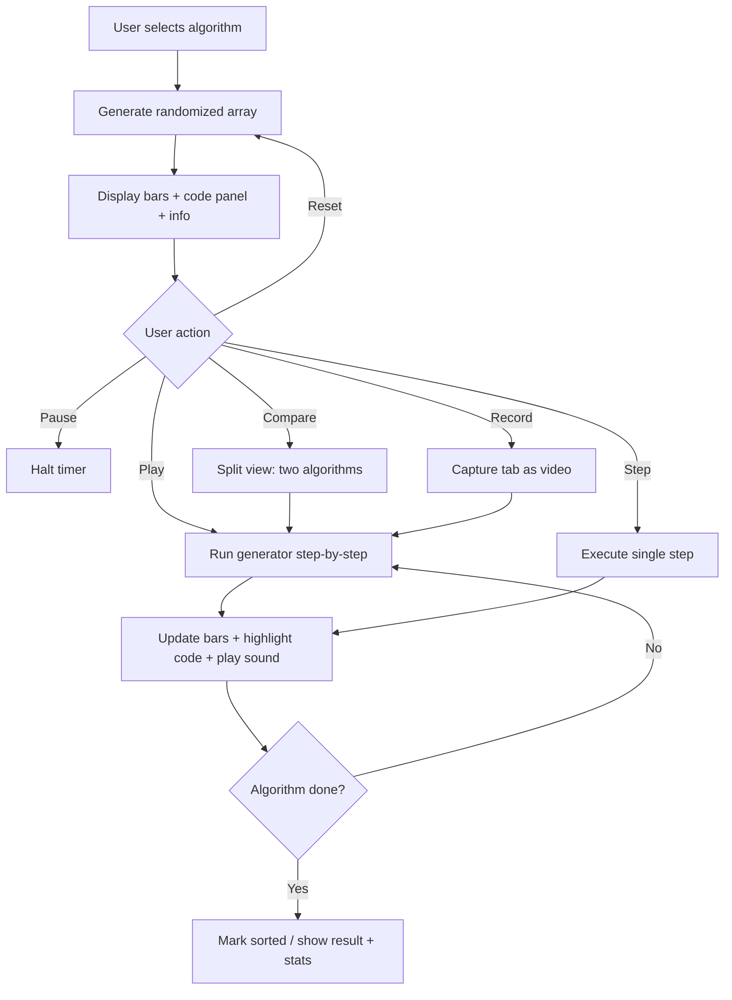
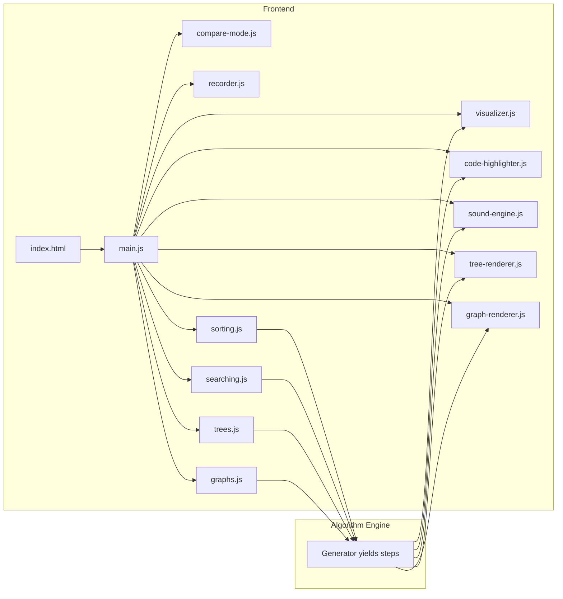

## DSA Visualizer

An interactive web application for visualizing data structures and algorithms in real time. Watch sorting, searching, tree, and graph algorithms execute step-by-step with synchronized code highlighting across multiple programming languages. Built for learning DSA and creating educational content.

### Application Flow



### Features

- Real-time visualization of 14 sorting, 5 searching, 5 tree, and 3 graph algorithms
- 3-panel layout: algorithm info (left), code (center), visualization (right)
- Synchronized code highlighting with step-numbered inline comments
- Multi-language code display: Pseudocode, Python, Java, C++, C, C#, JavaScript, TypeScript, Go, Rust
- Python code includes full type hints
- Algorithm info panel: plain-English description, best use case, when to avoid
- Compare mode: run two algorithms side by side on the same array
- Sound effects via Web Audio API mapped to bar values
- Collapsible DSA cheat sheet with complexity tables and key ideas
- Portrait mode: true 9:16 column layout for YouTube Shorts recording
- Landscape mode: full-width 3-panel layout for desktop viewing
- Built-in recording with 6 quality presets (720p to 4K, portrait and landscape)
- Keyboard shortcuts: Space (play/pause), Right Arrow (step), R (reset), G (generate)
- Adjustable array size, speed, and distribution type (random, nearly sorted, reversed, few unique)
- Fisher-Yates shuffle for truly randomized starting arrays
- Reset generates a fresh random array each time

### Supported Algorithms

#### Sorting (14)

| Algorithm           | Best       | Average      | Worst      | Space    | Stable |
|---------------------|------------|--------------|------------|----------|--------|
| Bubble Sort         | O(n)       | O(n^2)       | O(n^2)     | O(1)     | Yes    |
| Selection Sort      | O(n^2)     | O(n^2)       | O(n^2)     | O(1)     | No     |
| Insertion Sort      | O(n)       | O(n^2)       | O(n^2)     | O(1)     | Yes    |
| Merge Sort          | O(n log n) | O(n log n)   | O(n log n) | O(n)     | Yes    |
| Quick Sort          | O(n log n) | O(n log n)   | O(n^2)     | O(log n) | No     |
| Heap Sort           | O(n log n) | O(n log n)   | O(n log n) | O(1)     | No     |
| Shell Sort          | O(n log n) | O(n^(4/3))   | O(n^(3/2)) | O(1)     | No     |
| Counting Sort       | O(n + k)   | O(n + k)     | O(n + k)   | O(k)     | Yes    |
| Gnome Sort          | O(n)       | O(n^2)       | O(n^2)     | O(1)     | Yes    |
| Cocktail Shaker     | O(n)       | O(n^2)       | O(n^2)     | O(1)     | Yes    |
| Pancake Sort        | O(n)       | O(n^2)       | O(n^2)     | O(1)     | No     |
| Bogo Sort           | O(n)       | O(n*n!)      | O(inf)     | O(1)     | No     |
| Thanos Sort         | O(n)       | O(n log n)   | O(n log n) | O(n)     | No     |
| Stalin Sort         | O(n)       | O(n)         | O(n)       | O(1)     | Yes    |

#### Searching (5)

| Algorithm        | Best | Average    | Worst      | Space | Requires |
|------------------|------|------------|------------|-------|----------|
| Linear Search    | O(1) | O(n)       | O(n)       | O(1)  | Nothing  |
| Binary Search    | O(1) | O(log n)   | O(log n)   | O(1)  | Sorted   |
| Jump Search      | O(1) | O(sqrt(n)) | O(sqrt(n)) | O(1)  | Sorted   |
| Ternary Search   | O(1) | O(log n)   | O(log n)   | O(1)  | Sorted   |
| Fibonacci Search | O(1) | O(log n)   | O(log n)   | O(1)  | Sorted   |

#### Trees (5)

| Algorithm            | Best       | Average    | Worst  | Space    |
|----------------------|------------|------------|--------|----------|
| BST Insert           | O(log n)   | O(log n)   | O(n)   | O(1)     |
| BST Search           | O(1)       | O(log n)   | O(n)   | O(1)     |
| In-Order Traversal   | O(n)       | O(n)       | O(n)   | O(h)     |
| Pre-Order Traversal  | O(n)       | O(n)       | O(n)   | O(h)     |
| Post-Order Traversal | O(n)       | O(n)       | O(n)   | O(h)     |

#### Graphs (3)

| Algorithm  | Best       | Average    | Worst      | Space      |
|------------|------------|------------|------------|------------|
| BFS        | O(V + E)   | O(V + E)   | O(V + E)   | O(V)       |
| DFS        | O(V + E)   | O(V + E)   | O(V + E)   | O(V)       |
| Dijkstra   | O(V + E)   | O(V + E log V) | O(V^2) | O(V)       |

### Recording Quality Presets

| Preset           | Resolution | Bitrate  | FPS |
|------------------|------------|----------|-----|
| Shorts 720p      | 720x1280   | 5 Mbps   | 60  |
| Shorts 1080p     | 1080x1920  | 8 Mbps   | 60  |
| Shorts 4K        | 2160x3840  | 20 Mbps  | 60  |
| Landscape 720p   | 1280x720   | 5 Mbps   | 30  |
| Landscape 1080p  | 1920x1080  | 8 Mbps   | 60  |
| Landscape 4K     | 3840x2160  | 20 Mbps  | 60  |

### Keyboard Shortcuts

| Key         | Action           |
|-------------|------------------|
| Space       | Play / Pause     |
| Right Arrow | Step (when paused) |
| R           | Reset            |
| G           | Generate new array |

### Getting Started

#### Prerequisites

- Node.js 18+
- pnpm

#### Setup

```bash
chmod +x setup.sh && ./setup.sh
```

#### Development

```bash
pnpm dev
```

Opens the application at `http://localhost:3000`.

#### Production Build

```bash
pnpm build
pnpm preview
```

#### Docker

Build and run:

```bash
docker compose up --build
```

Access at `http://localhost:8080`.

### Project Structure

```
dsa-visualizer/
    index.html                      Entry point
    package.json                    Dependencies and scripts (pnpm)
    vite.config.js                  Vite dev server and build config
    dockerfile                      Multi-stage Docker build (node + nginx)
    docker-compose.yaml             Container orchestration
    setup.sh                        Self-healing setup script
    src/
        static/
            css/
                main.css            Styles (3-panel, dark theme, portrait mode)
            js/
                main.js             Controller, events, playback, shortcuts
                visualizer.js       Bar rendering engine
                tree-renderer.js    SVG tree node/edge renderer
                graph-renderer.js   SVG graph node/edge renderer
                code-highlighter.js Code display with comment coloring
                sound-engine.js     Web Audio API tones and effects
                compare-mode.js     Side-by-side algorithm comparison
                recorder.js         Tab recording with quality presets
                algorithms/
                    sorting.js      14 sorting generators + 10-language code
                    searching.js    5 search generators + 10-language code
                    trees.js        5 BST generators + 10-language code
                    graphs.js       3 graph generators + 10-language code
    tasks/
        todo.md                     Phased task tracking
        lessons.md                  Lessons learned across sessions
```

### Architecture



Each algorithm is implemented as a JavaScript generator function that yields step objects containing the operation type, affected indices or node IDs, and the corresponding code line number. The main controller consumes these steps on a timer, updating the visualization (bars for sorting/searching, SVG for trees/graphs), code highlight, and sound in lockstep. In compare mode, two generators run in parallel on copies of the same array. The recorder captures the browser tab via the MediaRecorder API with configurable quality presets.
