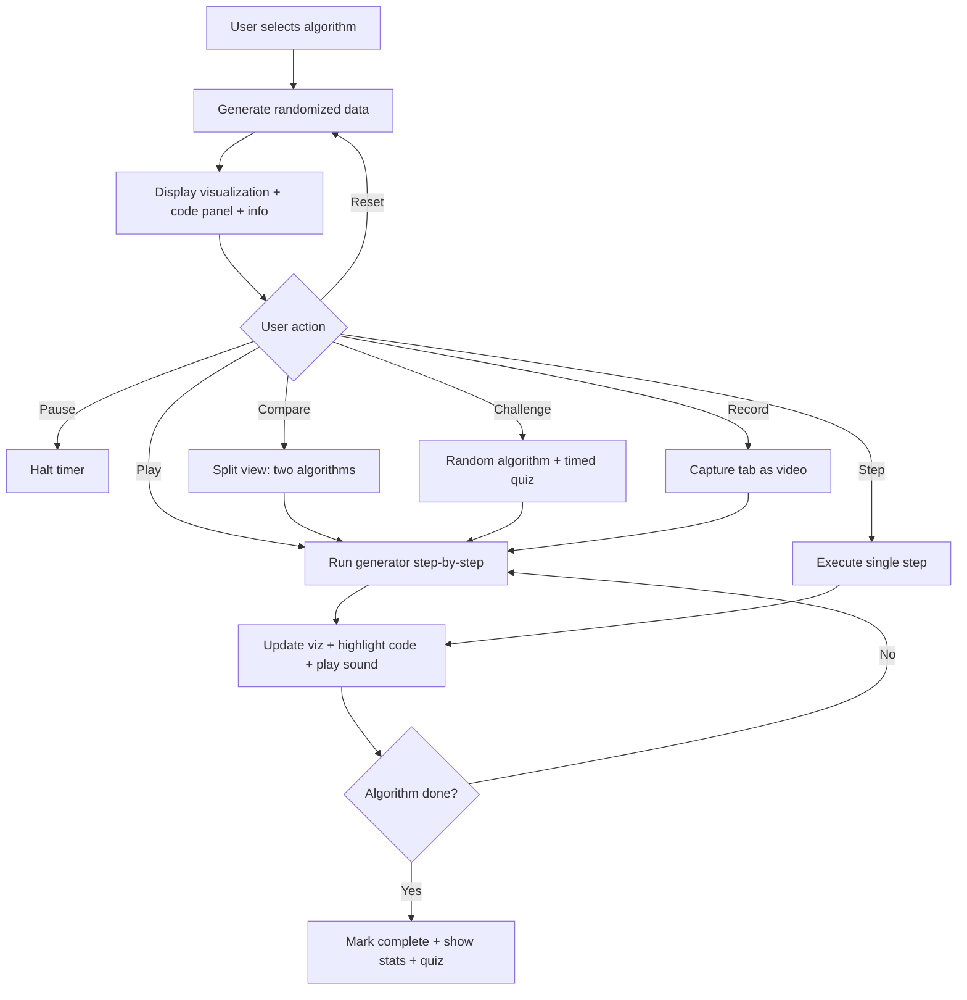
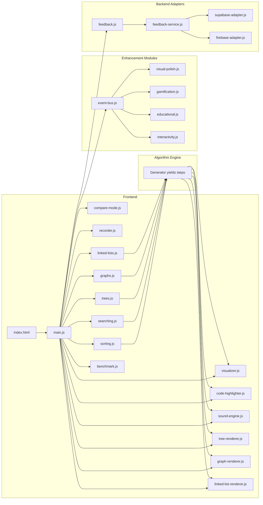

## DSA Visualizer

An interactive web application for visualizing data structures and algorithms in real time. Watch sorting, searching, tree, graph, and linked list algorithms execute step-by-step with synchronized code highlighting across multiple programming languages. Built for learning DSA and creating educational content.

### Application Flow



### Features

- Real-time visualization of 19 sorting, 8 searching, 10 tree, 7 graph, 14 linked list, and 7 maze/pathfinding algorithms
- 3-panel layout: algorithm info (left), code (center), visualization (right)
- Synchronized code highlighting with step-numbered inline comments
- Multi-language code display: Pseudocode, Python, Java, C++, C, C#, JavaScript, TypeScript, Go, Rust
- Python code includes full type hints
- Algorithm info panel: plain-English description, best use case, when to avoid
- Compare mode: run two algorithms side by side on the same array
- Dark/light theme toggle with persistence
- Mobile responsive layout (breakpoints at 1024px, 768px, 480px)
- Custom array input with validation
- Algorithm performance benchmarking (20 runs across 4 sizes with bar chart)
- Sound effects via Web Audio API mapped to bar values
- Collapsible DSA cheat sheet with complexity tables and key ideas
- Interactive graph builder: add/remove nodes and weighted edges
- Graph representations: adjacency matrix, adjacency list, or both side-by-side
- Graph export to JSON
- Draggable graph nodes with real-time edge following
- Portrait mode: true 9:16 column layout for YouTube Shorts recording
- Landscape mode: full-width 3-panel layout for desktop viewing
- Built-in recording with 6 quality presets (720p to 4K, portrait and landscape)
- Keyboard shortcuts: Space (play/pause), Right Arrow (step), R (reset), G (generate)
- Drag-and-drop bar reordering with undo/redo (Ctrl+Z / Ctrl+Shift+Z)
- Color themes: Default, Ocean, Forest, Sunset, Monochrome
- Confetti particle effects on algorithm completion
- Achievement system with 8 achievements, streak tracking, and toast notifications
- Post-algorithm quizzes with multiple-choice questions, explanations, and score tracking
- Challenge Mode: random algorithm with timed quiz
- Feedback system with adapter pattern (Supabase/Firebase)
- Adjustable array size, speed, and distribution type (random, nearly sorted, reversed, few unique)
- Fisher-Yates shuffle for truly randomized starting arrays
- Reset generates a fresh random array each time

### Supported Algorithms

#### Sorting (19)

| Algorithm           | Best       | Average      | Worst      | Space    | Stable |
|---------------------|------------|--------------|------------|----------|--------|
| Bubble Sort         | O(n)       | O(n^2)       | O(n^2)     | O(1)     | Yes    |
| Selection Sort      | O(n^2)     | O(n^2)       | O(n^2)     | O(1)     | No     |
| Insertion Sort      | O(n)       | O(n^2)       | O(n^2)     | O(1)     | Yes    |
| Merge Sort          | O(n log n) | O(n log n)   | O(n log n) | O(n)     | Yes    |
| Quick Sort          | O(n log n) | O(n log n)   | O(n^2)     | O(log n) | No     |
| Heap Sort           | O(n log n) | O(n log n)   | O(n log n) | O(1)     | No     |
| Shell Sort          | O(n log n) | O(n^(4/3))   | O(n^(3/2)) | O(1)     | No     |
| Counting Sort       | O(n + k)   | O(n + k)     | O(n + k)   | O(k)     | Yes    |
| Gnome Sort          | O(n)       | O(n^2)       | O(n^2)     | O(1)     | Yes    |
| Cocktail Shaker     | O(n)       | O(n^2)       | O(n^2)     | O(1)     | Yes    |
| Pancake Sort        | O(n)       | O(n^2)       | O(n^2)     | O(1)     | No     |
| Radix Sort          | O(d(n+k))  | O(d(n+k))    | O(d(n+k))  | O(n+k)   | Yes    |
| Bucket Sort         | O(n + k)   | O(n + n^2/k) | O(n^2)     | O(n + k) | Yes    |
| Tim Sort            | O(n)       | O(n log n)   | O(n log n) | O(n)     | Yes    |
| Comb Sort           | O(n log n) | O(n^2/2^p)   | O(n^2)     | O(1)     | No     |
| Odd-Even Sort       | O(n)       | O(n^2)       | O(n^2)     | O(1)     | Yes    |
| Bogo Sort           | O(n)       | O(n*n!)      | O(inf)     | O(1)     | No     |
| Thanos Sort         | O(n)       | O(n log n)   | O(n log n) | O(n)     | No     |
| Stalin Sort         | O(n)       | O(n)         | O(n)       | O(1)     | Yes    |

Fun/meme sorts also include Sleep Sort and Miracle Sort.

#### Searching (8)

| Algorithm               | Best      | Average    | Worst      | Space | Requires |
|-------------------------|-----------|------------|------------|-------|----------|
| Linear Search           | O(1)      | O(n)       | O(n)       | O(1)  | Nothing  |
| Binary Search           | O(1)      | O(log n)   | O(log n)   | O(1)  | Sorted   |
| Jump Search             | O(1)      | O(sqrt(n)) | O(sqrt(n)) | O(1)  | Sorted   |
| Ternary Search          | O(1)      | O(log3 n)  | O(log3 n)  | O(1)  | Sorted   |
| Fibonacci Search        | O(1)      | O(log n)   | O(log n)   | O(1)  | Sorted   |
| Interpolation Search    | O(1)      | O(log log n)| O(n)       | O(1)  | Uniform  |
| Exponential Search      | O(1)      | O(log n)   | O(log n)   | O(1)  | Sorted   |
| Sentinel Linear Search  | O(1)      | O(n)       | O(n)       | O(1)  | Nothing  |

#### Trees (10)

| Algorithm              | Best       | Average    | Worst      | Space    |
|------------------------|------------|------------|------------|----------|
| BST Insert             | O(log n)   | O(log n)   | O(n)       | O(1)     |
| BST Search             | O(1)       | O(log n)   | O(n)       | O(1)     |
| BST Delete             | O(log n)   | O(log n)   | O(n)       | O(1)     |
| AVL Insert             | O(log n)   | O(log n)   | O(log n)   | O(log n) |
| Level-Order (BFS)      | O(n)       | O(n)       | O(n)       | O(w)     |
| In-Order Traversal     | O(n)       | O(n)       | O(n)       | O(h)     |
| Pre-Order Traversal    | O(n)       | O(n)       | O(n)       | O(h)     |
| Post-Order Traversal   | O(n)       | O(n)       | O(n)       | O(h)     |
| Min-Heap Insert        | O(1)       | O(log n)   | O(log n)   | O(1)     |
| Min-Heap Extract       | O(log n)   | O(log n)   | O(log n)   | O(1)     |

#### Graphs (7)

| Algorithm         | Best       | Average        | Worst      | Space      |
|-------------------|------------|----------------|------------|------------|
| BFS               | O(V + E)   | O(V + E)       | O(V + E)   | O(V)       |
| DFS               | O(V + E)   | O(V + E)       | O(V + E)   | O(V)       |
| Dijkstra          | O(V + E)   | O(V + E log V) | O(V^2)     | O(V)       |
| A* Pathfinding    | O(E)       | O(E log V)     | O(b^d)     | O(V)       |
| Bellman-Ford      | O(V + E)   | O(V * E)       | O(V * E)   | O(V)       |
| Kruskal's MST     | O(E log E) | O(E log E)     | O(E log E) | O(V + E)   |
| Topological Sort  | O(V + E)   | O(V + E)       | O(V + E)   | O(V)       |

#### Linked Lists (14)

| Algorithm          | Best       | Average    | Worst      | Space    |
|--------------------|------------|------------|------------|----------|
| Insert at Head     | O(1)       | O(1)       | O(1)       | O(1)     |
| Insert at Tail     | O(n)       | O(n)       | O(n)       | O(1)     |
| Insert at Position | O(n)       | O(n)       | O(n)       | O(1)     |
| Insert After Value | O(n)       | O(n)       | O(n)       | O(1)     |
| Delete Head        | O(1)       | O(1)       | O(1)       | O(1)     |
| Delete Tail        | O(n)       | O(n)       | O(n)       | O(1)     |
| Delete at Position | O(n)       | O(n)       | O(n)       | O(1)     |
| Delete by Value    | O(n)       | O(n)       | O(n)       | O(1)     |
| Search Value       | O(1)       | O(n)       | O(n)       | O(1)     |
| Traverse All       | O(n)       | O(n)       | O(n)       | O(1)     |
| Reverse List       | O(n)       | O(n)       | O(n)       | O(1)     |
| Detect Cycle       | O(n)       | O(n)       | O(n)       | O(1)     |
| Merge Sorted Lists | O(n + m)   | O(n + m)   | O(n + m)   | O(1)     |
| Merge Sort         | O(n log n) | O(n log n) | O(n log n) | O(log n) |

### Recording Quality Presets

| Preset           | Resolution | Bitrate  | FPS |
|------------------|------------|----------|-----|
| Shorts 720p      | 720x1280   | 5 Mbps   | 60  |
| Shorts 1080p     | 1080x1920  | 8 Mbps   | 60  |
| Shorts 4K        | 2160x3840  | 20 Mbps  | 60  |
| Landscape 720p   | 1280x720   | 5 Mbps   | 30  |
| Landscape 1080p  | 1920x1080  | 8 Mbps   | 60  |
| Landscape 4K     | 3840x2160  | 20 Mbps  | 60  |

### Keyboard Shortcuts

| Key         | Action              |
|-------------|---------------------|
| Space       | Play / Pause        |
| Right Arrow | Step (when paused)  |
| R           | Reset               |
| G           | Generate new array  |
| Ctrl+Z      | Undo bar reorder    |
| Ctrl+Shift+Z| Redo bar reorder    |

### Getting Started

See [docs/setup.md](docs/setup.md) for full setup instructions, Docker deployment, and troubleshooting.

Quick start:

```bash
chmod +x setup.sh && ./setup.sh
pnpm dev
```

### Project Structure

```
dsa-visualizer/
    index.html                      Entry point
    package.json                    Dependencies and scripts (pnpm)
    vite.config.js                  Vite dev server and build config
    dockerfile                      Multi-stage Docker build (node + nginx)
    docker-compose.yaml             Container orchestration
    setup.sh                        Self-healing setup script
    src/
        static/
            css/
                main.css            Styles (3-panel, dark/light theme, responsive)
            js/
                main.js             Controller, events, playback, shortcuts
                visualizer.js       Bar rendering engine
                tree-renderer.js    SVG tree node/edge renderer
                graph-renderer.js   SVG graph node/edge renderer
                linked-list-renderer.js  Linked list node/arrow renderer
                maze-renderer.js    Canvas-based maze/grid renderer
                code-highlighter.js Code display with comment coloring
                sound-engine.js     Web Audio API tones and effects
                compare-mode.js     Side-by-side algorithm comparison
                recorder.js         Tab recording with quality presets
                benchmark.js        Algorithm performance benchmarking
                event-bus.js        Lightweight event emitter for modules
                config.js           Feature flags for enhancement modules
                feedback.js         Feedback modal UI
                feedback-service.js Feedback service with adapter pattern
                adapters/
                    supabase-adapter.js   Supabase backend adapter
                    firebase-adapter.js   Firebase backend adapter
                enhancements/
                    visual-polish.js  Themes, confetti, color effects
                    gamification.js   Achievements, streaks, tracking
                    educational.js    Quizzes, challenge mode, scores
                    interactivity.js  Drag-and-drop bars and graph nodes
                algorithms/
                    sorting.js        Core sorting generators (aggregator)
                    sorting-extended.js  Extended/practical sorts
                    sorting-meme.js   Novelty/fun sorts
                    searching.js      Search generators + 10-language code
                    trees.js          Tree generators + 10-language code
                    graphs.js         Graph generators + 10-language code
                    linked-lists.js   Linked list operations + 10-language code
                    maze.js           Maze generation + grid pathfinding + 10-language code
    docs/
        setup.md                     Setup and deployment guide
        adding-algorithms.md         Guide for adding new algorithms
        linked-lists.md              Linked list implementation spec
        feedback.md                  Feedback system architecture
        enhancements.md              Enhancement module architecture
        e2e-testing.md               End-to-end testing guide
        user-guide.md                End-user feature guide
        changelog.md                 Project changelog
    tasks/
        todo.md                      Phased task tracking
        lessons.md                   Lessons learned across sessions
```

### Architecture



Each algorithm is implemented as a JavaScript generator function that yields step objects containing the operation type, affected indices or node IDs, and the corresponding code line number. The main controller consumes these steps on a timer, updating the visualization (bars for sorting/searching, SVG for trees/graphs/linked lists), code highlight, and sound in lockstep. In compare mode, two generators run in parallel on copies of the same array.

Enhancement modules subscribe to lifecycle events via a lightweight event bus (`algorithm:start`, `algorithm:step`, `algorithm:complete`, `algorithm:reset`), keeping them fully decoupled from core logic. Each module can be independently enabled or disabled via feature flags in `config.js`.

The feedback system uses an adapter pattern where the UI communicates with a service layer, and the service delegates to a swappable backend adapter (Supabase or Firebase). The recorder captures the browser tab via the MediaRecorder API with configurable quality presets.

### Adding New Algorithms

See [docs/adding-algorithms.md](docs/adding-algorithms.md) for full step-by-step guide with templates and examples.

### User Guide

See [docs/user-guide.md](docs/user-guide.md) for the end-user feature guide covering all interactive features, enhancements, and tips.

### Credits and References

#### Algorithm References

- [GeeksforGeeks](https://www.geeksforgeeks.org/) - Algorithm explanations, pseudocode references, and complexity analysis
- [Wikipedia - Sorting Algorithms](https://en.wikipedia.org/wiki/Sorting_algorithm) - Comprehensive sorting algorithm descriptions and properties
- [Wikipedia - Search Algorithms](https://en.wikipedia.org/wiki/Search_algorithm) - Search algorithm theory and complexity
- [Visualgo](https://visualgo.net/) - Inspiration for step-by-step algorithm visualization
- [CLRS - Introduction to Algorithms](https://mitpress.mit.edu/books/introduction-algorithms-fourth-edition) - Canonical algorithm reference (Cormen, Leiserson, Rivest, Stein)

#### Tools and Libraries

- [Vite](https://vitejs.dev/) - Frontend build tool and development server
- [pnpm](https://pnpm.io/) - Fast, disk space efficient package manager
- [Docker](https://www.docker.com/) - Containerization for production deployment
- [nginx](https://nginx.org/) - Production web server used in Docker image
- [Web Audio API](https://developer.mozilla.org/en-US/docs/Web/API/Web_Audio_API) - Browser API used for sound effects
- [MediaRecorder API](https://developer.mozilla.org/en-US/docs/Web/API/MediaRecorder) - Browser API used for built-in recording

#### Design Inspiration

- [Sorting Visualizer by Clement Mihailescu](https://github.com/clementmihailescu/Sorting-Visualizer) - Inspiration for bar-based sorting visualization
- [The Sound of Sorting](https://panthema.net/2013/sound-of-sorting/) - Inspiration for mapping sound to array values
- [Algorithm Visualizer](https://algorithm-visualizer.org/) - Inspiration for multi-language code display
