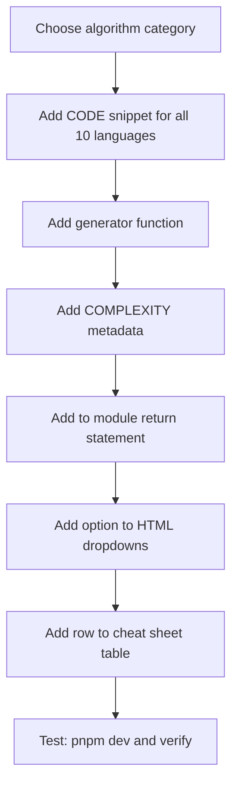

## Adding New Algorithms

This project follows a consistent pattern for all algorithm categories. Every new algorithm requires changes in exactly 4 places.

### Adding New Data Structure Types

For entirely new data structure visualizations (e.g., linked lists, stacks, queues), the process is more involved:

1. **Plan First**: Create a comprehensive specification document in `docs/` directory covering:
   - Algorithms to implement and their complexity
   - Data structure design and step object format
   - Visual design requirements (renderer specs)
   - UI integration needs (dropdown options, input controls)
   - Implementation order and success criteria

2. **Implement**: Following the plan, build:
   - Renderer module (`<structure>-renderer.js`)
   - Algorithm module with generators and code snippets (`algorithms/<structure>s.js`)
   - UI integration (HTML dropdowns, CSS styles, main.js controller updates)

3. **Track**: Add task checklist to `tasks/todo.md` with checkboxes

4. **Document**: Record lessons learned in `tasks/lessons.md` and update `docs/changelog.md`

See `docs/linked-lists.md` for a complete linked list planning example.

### Adding Algorithms to Existing Data Structure Categories

This project follows a consistent pattern for all algorithm categories. Every new algorithm requires changes in exactly 4 places.

### Flow



### Checklist

1. **Algorithm file** (`src/static/js/algorithms/<category>.js`)
2. **HTML dropdown** (`index.html`)
3. **Cheat sheet table** (`index.html`)
4. **Return/export statement** (bottom of the algorithm file)

### 1. Add Code Snippets

Inside the `CODE` object, add a new key with code arrays for all 10 languages. Each array element is one line of code.

```javascript
CODE.myNewSort = {
    pseudo: [
        '# Step 1: Start the my new sort procedure with list A',
        'procedure myNewSort(A):',
        '',
        '    n = length(A)  # [2] Get the number of items',
        // ... more lines with step-numbered inline comments
    ],
    python: [ /* ... */ ],
    java: [ /* ... */ ],
    cpp: [ /* ... */ ],
    c: [ /* ... */ ],
    csharp: [ /* ... */ ],
    javascript: [ /* ... */ ],
    typescript: [ /* ... */ ],
    go: [ /* ... */ ],
    rust: [ /* ... */ ],
};
```

**Code snippet rules:**

- First line is always a section comment (e.g., `# Step 1: ...`)
- Inline comments use step numbers: `# [2] Explain what this does`
- Use blank lines (`''`) to separate logical sections
- Python must include type hints
- Keep comments plain English, aimed at beginners

### 2. Add the Generator Function

Below the `CODE` object, add a generator function that mutates the array and yields step objects.

```javascript
/**
 * My New Sort generator.
 *
 * @param {number[]} arr - The array to sort (mutated in place).
 * @yields {object} Step object with type, indices, and codeLine.
 */
function* myNewSort(arr) {
    // Algorithm logic here
    yield { type: 'compare', indices: [i, j], codeLine: 3 };
    yield { type: 'swap', indices: [i, j], codeLine: 5 };
    // Mark all as sorted at the end
    for (let i = 0; i < arr.length; i++) {
        yield { type: 'sorted', indices: [i], codeLine: 8 };
    }
}
```

**Step types by category:**

| Category  | Valid step types                                              |
|-----------|---------------------------------------------------------------|
| Sorting   | `compare`, `swap`, `overwrite`, `sorted`, `partition`, `pivot`|
| Searching | `check`, `found`, `eliminate`, `notFound`                     |
| Trees     | `visit`, `compare`, `insert`, `found`, `notFound`             |
| Graphs    | `enqueue`, `dequeue`, `visit`, `visited`, `push`, `relax`, `update` |

### 3. Add Complexity Data

Inside the `COMPLEXITY` object, add an entry with the algorithm's metadata.

```javascript
COMPLEXITY.myNewSort = {
    name: 'My New Sort',
    best: 'O(n)',
    average: 'O(n\u00B2)',    // \u00B2 = superscript 2
    worst: 'O(n\u00B2)',
    space: 'O(1)',
    description: 'Plain English explanation of how the algorithm works.',
    useCase: 'When and why to use this algorithm.',
    avoid: 'When not to use this algorithm and what to use instead.',
};
```

### 4. Export the Generator

Add the new function name to the `return` statement at the bottom of the module.

```javascript
return { CODE, COMPLEXITY, bubbleSort, /* ... */, myNewSort };
```

### 5. Add to HTML

Add an `<option>` inside the correct `<optgroup>` in **both** algorithm dropdowns (primary and compare).

```html
<option value="myNewSort">My New Sort</option>
```

### 6. Add to Cheat Sheet

Add a `<tr>` row to the appropriate cheat sheet table in `index.html`.

Sorting format:

```html
<tr><td>My New Sort</td><td>O(n)</td><td>O(n^2)</td><td>O(n^2)</td><td>O(1)</td><td>Yes</td></tr>
```

Searching format:

```html
<tr><td>My New Search</td><td>O(1)</td><td>O(log n)</td><td>O(log n)</td><td>Sorted</td></tr>
```

### File Locations

| What to change         | File                                       |
|------------------------|--------------------------------------------|
| Sorting algorithms     | `src/static/js/algorithms/sorting.js`      |
| Searching algorithms   | `src/static/js/algorithms/searching.js`    |
| Tree algorithms        | `src/static/js/algorithms/trees.js`        |
| Graph algorithms       | `src/static/js/algorithms/graphs.js`       |
| Dropdowns + cheat sheet| `index.html`                               |
| Styles                 | `src/static/css/main.css`                  |
| Main controller        | `src/static/js/main.js`                    |

### Line Count Reference

Typical pseudocode line counts per category, for sizing the portrait code panel:

| Category  | Min | Max | Median | Average |
|-----------|-----|-----|--------|---------|
| Sorting   | 14  | 28  | 21     | 20      |
| Searching | 6   | 33  | 17     | 20      |
| Trees     | 9   | 13  | 9      | 10      |
| Graphs    | 16  | 23  | 17     | 19      |
