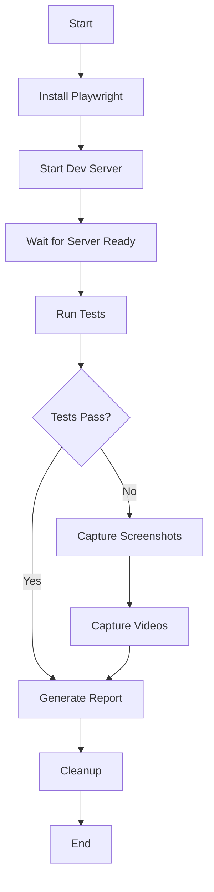

# End-to-End Testing with Playwright

## Overview

This document describes the end-to-end (E2E) testing setup for the DSA Visualizer project using Playwright. E2E tests verify that the application works correctly from a user's perspective by simulating real user interactions in a browser.

## Test Architecture

### Directory Structure

```
tests/
├── e2e/
│   ├── test-utils.js                      # Shared test utilities and helpers
│   ├── core-functionality.spec.js         # Basic UI and playback tests
│   ├── sorting-algorithms.spec.js         # Sorting algorithm tests
│   ├── searching-algorithms.spec.js       # Searching algorithm tests
│   ├── tree-algorithms.spec.js            # Tree algorithm tests
│   ├── graph-algorithms.spec.js           # Graph algorithm tests
│   ├── linked-list-algorithms.spec.js     # Linked list algorithm tests
│   └── advanced-features.spec.js          # Compare mode, shortcuts, etc.
└── *.test.js                              # Unit tests (Vitest)
```

### Test Categories

1. **Core Functionality Tests** (`core-functionality.spec.js`)
   - Page load and initialization
   - Algorithm selection
   - Array size controls
   - Playback controls (play, pause, step, reset, generate)
   - Code panel display
   - Info panel display
   - Statistics tracking

2. **Sorting Algorithm Tests** (`sorting-algorithms.spec.js`)
   - Basic sorts (Bubble, Selection, Insertion)
   - Efficient sorts (Merge, Quick, Heap)
   - Extended sorts (Shell, Counting, Gnome, etc.)
   - Fun/meme sorts (Bogo, Thanos, Stalin)
   - Different array distributions

3. **Searching Algorithm Tests** (`searching-algorithms.spec.js`)
   - Linear Search
   - Binary Search
   - Jump Search
   - Ternary Search
   - Fibonacci Search
   - Found/not found scenarios

4. **Tree Algorithm Tests** (`tree-algorithms.spec.js`)
   - BST operations (insert, search, delete)
   - Tree traversals (in-order, pre-order, post-order, level-order)
   - AVL tree operations
   - Heap operations

5. **Graph Algorithm Tests** (`graph-algorithms.spec.js`)
   - BFS and DFS traversals
   - Dijkstra's shortest path
   - A* pathfinding
   - Bellman-Ford
   - Kruskal's MST
   - Topological sort

6. **Linked List Algorithm Tests** (`linked-list-algorithms.spec.js`)
   - Insert operations (head, tail, position, after value)
   - Delete operations (head, tail, position, by value)
   - Search and traverse
   - Advanced operations (reverse, detect cycle, merge, sort)

7. **Advanced Features Tests** (`advanced-features.spec.js`)
   - Compare mode
   - Keyboard shortcuts
   - Sound toggle
   - Theme toggle
   - Portrait/landscape mode
   - Recording feature
   - Cheat sheet
   - Custom array input

## Configuration

### Playwright Configuration (`playwright.config.js`)

```javascript
import { defineConfig, devices } from '@playwright/test';

export default defineConfig({
  testDir: './tests/e2e',
  fullyParallel: false,
  forbidOnly: !!process.env.CI,
  retries: process.env.CI ? 2 : 0,
  workers: 1,
  reporter: [
    ['html', { outputFolder: 'playwright-report' }],
    ['list']
  ],
  use: {
    baseURL: 'http://localhost:3000',
    trace: 'on-first-retry',
    screenshot: 'only-on-failure',
    video: 'retain-on-failure',
    actionTimeout: 10000,
  },
  projects: [
    {
      name: 'chromium',
      use: { ...devices['Desktop Chrome'] },
    },
  ],
  webServer: {
    command: 'pnpm dev',
    url: 'http://localhost:3000',
    reuseExistingServer: !process.env.CI,
    timeout: 120000,
  },
});
```

### Key Configuration Options

- **testDir**: Directory containing E2E test files
- **fullyParallel**: Disabled to prevent race conditions
- **workers**: Set to 1 for sequential execution
- **baseURL**: Development server URL
- **webServer**: Automatically starts dev server before tests
- **reporters**: HTML report + console output
- **screenshot/video**: Captured only on failures

## Running Tests

### Available NPM Scripts

```bash
# Run all E2E tests
pnpm test:e2e

# Run tests with UI mode (interactive)
pnpm test:e2e:ui

# Run tests in debug mode
pnpm test:e2e:debug

# View test report
pnpm test:e2e:report
```

### Running Specific Tests

```bash
# Run specific test file
npx playwright tests/e2e/core-functionality.spec.js

# Run tests matching a pattern
npx playwright test --grep "sorting"

# Run tests in specific browser
npx playwright test --project=chromium

# Run tests with headed browser
npx playwright test --headed
```

### Test Execution Flow



## Writing Tests

### Test Utilities (`test-utils.js`)

The test utilities file provides helper functions for common operations:

```javascript
import { waitForVisualizerReady, selectAlgorithm, clickPlay } from './test-utils';

test('should sort array', async ({ page }) => {
  await page.goto('/');
  await waitForVisualizerReady(page);
  await selectAlgorithm(page, 'bubbleSort');
  await clickPlay(page);
  // assertions...
});
```

### Available Utilities

- `waitForVisualizerReady(page)` - Wait for page to fully load
- `selectAlgorithm(page, algorithmValue)` - Select algorithm from dropdown
- `setArraySize(page, size)` - Set array size
- `clickPlay/pause/step/reset/generate(page)` - Playback controls
- `setSearchTarget(page, target)` - Set search target value
- `waitForCompletion(page, timeout)` - Wait for sorting to complete
- `getBarCount(page)` - Get number of bars
- `getStatistics(page)` - Get comparison/swap/time stats
- `isCodePanelVisible(page)` - Check if code panel has content
- `isInfoPanelVisible(page)` - Check if info panel has content
- `toggleSound(page)` - Toggle sound on/off
- `enterCompareMode/exitCompareMode(page)` - Toggle compare mode
- `selectCompareAlgorithm(page, algorithmValue)` - Select second algorithm

### Algorithm Categories

The utilities file exports categorized algorithm lists:

```javascript
ALGORITHM_CATEGORIES = {
  SORTING: {
    BASIC: ['bubbleSort', 'selectionSort', 'insertionSort'],
    EFFICIENT: ['mergeSort', 'quickSort', 'heapSort'],
    EXTENDED: ['shellSort', 'countingSort', ...],
    FUN: ['bogoSort', 'thanosSort', 'stalinSort']
  },
  SEARCHING: ['linearSearch', 'binarySearch', ...],
  TREES: { BST: [...], AVL: [...], HEAP: [...] },
  GRAPHS: ['bfs', 'dfs', 'dijkstra', ...],
  LINKED_LISTS: ['llInsertHead', 'llDeleteHead', ...]
}
```

### Test Pattern Example

```javascript
import { test, expect } from '@playwright/test';
import { waitForVisualizerReady, selectAlgorithm, clickPlay } from './test-utils';

test.describe('Algorithm Name', () => {
  test('should perform operation', async ({ page }) => {
    // Arrange: Navigate and setup
    await page.goto('/');
    await waitForVisualizerReady(page);
    
    // Act: Perform actions
    await selectAlgorithm(page, 'bubbleSort');
    await clickPlay(page);
    await page.waitForTimeout(2000);
    
    // Assert: Verify results
    const stats = await getStatistics(page);
    expect(stats.comparisons).toBeGreaterThan(0);
  });
});
```

## Test Best Practices

### 1. Use Descriptive Test Names

```javascript
// Good
test('should display found node when searching for existing value', ...)

// Bad
test('search works', ...)
```

### 2. Wait for Elements Properly

```javascript
// Good
await page.waitForSelector('.bar.sorted', { state: 'visible' });
await page.waitForTimeout(500); // Wait for animation

// Bad
await page.waitForTimeout(5000); // Arbitrary long wait
```

### 3. Use Test Utilities

```javascript
// Good
import { selectAlgorithm } from './test-utils';
await selectAlgorithm(page, 'bubbleSort');

// Bad
await page.selectOption('#algorithm-select', 'bubbleSort');
await page.waitForTimeout(300);
```

### 4. Handle Async Operations

```javascript
// Good
await clickPlay(page);
await waitForCompletion(page, 5000);

// Bad
await clickPlay(page);
// No wait, test continues immediately
```

### 5. Group Related Tests

```javascript
test.describe('BST Operations', () => {
  test.describe('Insert', () => {
    test('should insert into empty tree', ...);
    test('should maintain BST property', ...);
  });
  
  test.describe('Search', () => {
    test('should find existing node', ...);
    test('should handle not found', ...);
  });
});
```

### 6. Use Appropriate Timeouts

```javascript
// Fast operations
await page.waitForTimeout(300);

// Animations
await page.waitForTimeout(500);

// Algorithm completion (depends on size/speed)
await waitForCompletion(page, TIMEOUTS.MEDIUM_SORT);
```

## Debugging Failed Tests

### View Test Report

```bash
pnpm test:e2e:report
```

The HTML report shows:
- Test execution timeline
- Screenshots of failures
- Videos of failed tests
- Error messages and stack traces

### Debug Mode

```bash
# Interactive debugging
pnpm test:e2e:debug

# Or with Playwright Inspector
npx playwright test --debug
```

### Common Issues

1. **Element not found**
   - Check selector syntax
   - Verify element is visible (not hidden)
   - Increase timeout if element loads slowly

2. **Timeout errors**
   - Increase timeout in test config
   - Check if dev server is running
   - Verify network connectivity

3. **Flaky tests**
   - Add proper waits between actions
   - Avoid arbitrary timeouts
   - Use `waitFor*` functions instead of `setTimeout`

4. **Wrong element selected**
   - Use more specific selectors
   - Check for multiple matching elements
   - Use `data-testid` attributes if needed

## CI/CD Integration

### GitHub Actions

Tests run automatically in CI pipeline:

```yaml
- name: Run E2E tests
  run: pnpm test:e2e
  
- name: Upload test results
  if: always()
  uses: actions/upload-artifact@v3
  with:
    name: playwright-report
    path: playwright-report/
```

### CI-Specific Configuration

- **retries**: 2 (retry failed tests)
- **workers**: 1 (sequential execution)
- **forbidOnly**: Prevents `.only` in CI
- **reporters**: HTML + list output

## Performance Considerations

### Test Execution Time

- Core functionality: ~1.5 minutes
- Sorting algorithms: ~2 minutes
- Searching algorithms: ~1 minute
- Tree algorithms: ~1.5 minutes
- Graph algorithms: ~1.5 minutes
- Linked list algorithms: ~1.5 minutes
- Advanced features: ~2 minutes

**Total: ~10-12 minutes for full suite**

### Optimization Strategies

1. **Parallelize independent tests** (when stable)
2. **Reduce array sizes** for algorithm tests
3. **Skip visual checks** in headless mode
4. **Use faster speed settings** for algorithm execution
5. **Mock slow operations** (recording, etc.)

## Maintenance

### Adding New Tests

1. Create new `.spec.js` file in `tests/e2e/`
2. Import test utilities
3. Follow existing test patterns
4. Add to CI if needed

### Updating Selectors

When UI elements change:

1. Update `test-utils.js` helper functions
2. Run tests to identify failures
3. Fix affected test files
4. Update documentation

### Test Data Management

- Use `ALGORITHM_CATEGORIES` for test data
- Keep test arrays small (5-20 elements)
- Avoid hardcoded values when possible

## Troubleshooting

### Browser Installation Issues

```bash
# Install browsers manually
npx playwright install chromium

# Install all browsers
npx playwright install
```

### Dev Server Port Conflicts

The dev server automatically finds an available port. If tests fail:

1. Kill existing processes on port 3000
2. Update `playwright.config.js` with different port
3. Ensure `baseURL` matches `webServer.url`

### Memory Issues

For large test suites:

1. Run tests in smaller batches
2. Increase Node memory: `NODE_OPTIONS="--max-old-space-size=4096"`
3. Use `--workers=1` to limit parallel processes

## References

- [Playwright Documentation](https://playwright.dev/)
- [Playwright Best Practices](https://playwright.dev/docs/best-practices)
- [Writing Tests](https://playwright.dev/docs/writing-tests)
- [Test Configuration](https://playwright.dev/docs/test-configuration)
