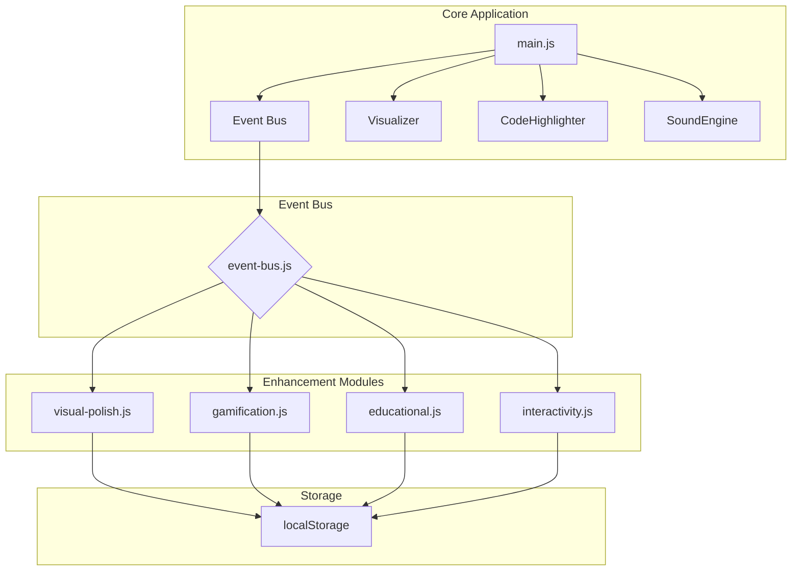
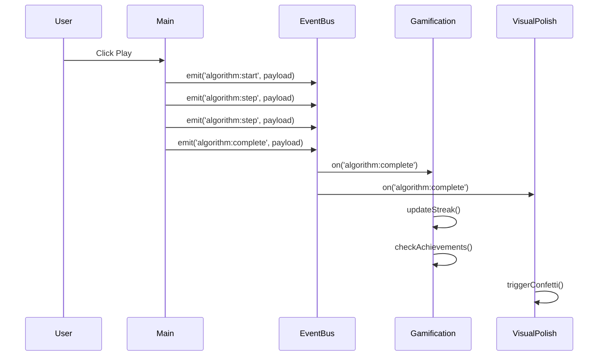

# User Experience Enhancements - Architecture Guide

This document describes the architecture for adding visual polish, gamification, educational, and interactivity enhancements to DSA Visualizer. The design prioritizes loose coupling, allowing modules to be added, removed, or replaced without affecting core functionality.

## Design Philosophy

### Loose Coupling via Event Bus

All enhancement modules communicate with the core application through a lightweight event bus. This ensures:

1. **Zero modification to core logic** - Enhancement modules only subscribe to events
2. **Swappable implementations** - Replace any module with a better solution later
3. **Independent development** - Work on enhancements without touching main.js
4. **Optional features** - Disable any enhancement without breaking the app

### Module Independence

Each enhancement category is a self-contained module that:
- Initializes independently
- Maintains its own state
- Persists data to localStorage
- Can be feature-flagged

## Architecture Overview



## Event Bus Implementation

### Event Types

The core application emits events at key lifecycle points. Enhancement modules subscribe to these events.



### Event Payloads

| Event | When Emitted | Payload |
|-------|--------------|---------|
| `algorithm:start` | Play button clicked | `{ algoKey, algoName, arraySize, arrayType }` |
| `algorithm:step` | Each visualization step | `{ stepNumber, stepType, indices, nodes }` |
| `algorithm:complete` | Algorithm finishes | `{ algoKey, algoName, stats: { comparisons, swaps, elapsedMs } }` |
| `algorithm:reset` | Reset button clicked | `{ algoKey }` |
| `algorithm:compare:start` | Compare mode starts | `{ algoKey1, algoKey2, arraySize }` |
| `algorithm:compare:complete` | Compare mode ends | `{ algoKey1, algoKey2, stats1, stats2 }` |
| `theme:change` | Theme toggled | `{ theme: 'dark' | 'light' }` |
| `recording:start` | Recording begins | `{ preset }` |
| `recording:stop` | Recording ends | `{ duration, fileSize }` |

### event-bus.js Implementation

```javascript
/**
 * Lightweight event emitter for decoupled module communication.
 * 
 * @example
 * import EventBus from './event-bus.js';
 * 
 * // Subscribe to events
 * EventBus.on('algorithm:complete', (payload) => {
 *     console.log('Algorithm finished:', payload.algoName);
 * });
 * 
 * // Emit events
 * EventBus.emit('algorithm:complete', { algoKey: 'bubbleSort', ... });
 */

class EventEmitter {
    constructor() {
        this.listeners = new Map();
    }

    on(event, callback) {
        if (!this.listeners.has(event)) {
            this.listeners.set(event, []);
        }
        this.listeners.get(event).push(callback);
        
        return () => this.off(event, callback);
    }

    off(event, callback) {
        const callbacks = this.listeners.get(event);
        if (callbacks) {
            const index = callbacks.indexOf(callback);
            if (index > -1) {
                callbacks.splice(index, 1);
            }
        }
    }

    emit(event, payload) {
        const callbacks = this.listeners.get(event);
        if (callbacks) {
            callbacks.forEach(callback => {
                try {
                    callback(payload);
                } catch (error) {
                    console.error(`Error in event handler for "${event}":`, error);
                }
            });
        }
    }

    once(event, callback) {
        const wrapper = (payload) => {
            callback(payload);
            this.off(event, wrapper);
        };
        this.on(event, wrapper);
    }
}

const EventBus = new EventEmitter();
export default EventBus;
```

## Module Specifications

### 6.1 Visual Polish Module

**File:** `src/static/js/enhancements/visual-polish.js`

**Purpose:** Enhance visual appeal without changing core rendering logic.

**Features:**

1. **Completion Effects**
   - Particle confetti on algorithm completion
   - Smooth fade-out after 2 seconds
   - Configurable particle count and colors

2. **Theme Extensions**
   - Additional color themes beyond dark/light
   - CSS custom properties for easy theming
   - Smooth theme transitions

3. **Animation Polish**
   - Staggered entrance animations for bars
   - Smooth panel collapse/expand
   - Micro-interactions on buttons

**Implementation:**

```javascript
/**
 * Visual polish enhancement module.
 * 
 * Subscribes to: algorithm:complete, theme:change
 * Emits: none
 */

import EventBus from '../event-bus.js';

const VisualPolish = {
    themes: {
        ocean: {
            primary: '#0ea5e9',
            secondary: '#06b6d4',
            background: '#0c4a6e',
            barDefault: '#38bdf8',
            barComparing: '#fbbf24',
            barSorted: '#22c55e'
        },
        forest: {
            primary: '#22c55e',
            secondary: '#16a34a',
            background: '#14532d',
            barDefault: '#4ade80',
            barComparing: '#fbbf24',
            barSorted: '#86efac'
        },
        sunset: {
            primary: '#f97316',
            secondary: '#ef4444',
            background: '#7c2d12',
            barDefault: '#fb923c',
            barComparing: '#fbbf24',
            barSorted: '#fcd34d'
        },
        monochrome: {
            primary: '#a3a3a3',
            secondary: '#737373',
            background: '#171717',
            barDefault: '#d4d4d4',
            barComparing: '#fafafa',
            barSorted: '#525252'
        }
    },

    init() {
        EventBus.on('algorithm:complete', this.onComplete.bind(this));
        this.loadSavedTheme();
    },

    onComplete(payload) {
        this.triggerConfetti();
    },

    triggerConfetti() {
        const container = document.getElementById('bars-container');
        const rect = container.getBoundingClientRect();
        
        for (let i = 0; i < 50; i++) {
            const particle = document.createElement('div');
            particle.className = 'confetti-particle';
            particle.style.left = `${rect.left + Math.random() * rect.width}px`;
            particle.style.top = `${rect.top}px`;
            particle.style.backgroundColor = this.getRandomColor();
            document.body.appendChild(particle);
            
            setTimeout(() => particle.remove(), 2000);
        }
    },

    applyTheme(themeName) {
        const theme = this.themes[themeName];
        if (!theme) return;

        Object.entries(theme).forEach(([key, value]) => {
            document.documentElement.style.setProperty(`--${this.camelToKebab(key)}`, value);
        });

        localStorage.setItem('dsa-visualizer-theme', themeName);
    },

    loadSavedTheme() {
        const saved = localStorage.getItem('dsa-visualizer-theme');
        if (saved && this.themes[saved]) {
            this.applyTheme(saved);
        }
    },

    camelToKebab(str) {
        return str.replace(/([a-z])([A-Z])/g, '$1-$2').toLowerCase();
    },

    getRandomColor() {
        const colors = ['#22c55e', '#3b82f6', '#f59e0b', '#ef4444', '#8b5cf6'];
        return colors[Math.floor(Math.random() * colors.length)];
    }
};

export default VisualPolish;
```

**CSS Additions:**

```css
/* src/static/css/enhancements.css */

.confetti-particle {
    position: fixed;
    width: 10px;
    height: 10px;
    border-radius: 50%;
    pointer-events: none;
    animation: confetti-fall 2s ease-out forwards;
    z-index: 1000;
}

@keyframes confetti-fall {
    0% {
        transform: translateY(0) rotate(0deg);
        opacity: 1;
    }
    100% {
        transform: translateY(300px) rotate(720deg);
        opacity: 0;
    }
}

/* Smooth theme transitions */
:root {
    transition: background-color 0.3s ease, color 0.3s ease;
}
```

### 6.2 Gamification Module

**File:** `src/static/js/enhancements/gamification.js`

**Purpose:** Add game-like elements to increase engagement and motivation.

**Features:**

1. **Streak Tracking**
   - Daily usage streak (consecutive days)
   - Streak breaks at midnight if not used
   - Visual streak counter in UI

2. **Achievement System**
   - Unlockable badges for milestones
   - Toast notification on unlock
   - Achievements gallery panel

3. **Statistics**
   - Total algorithms run
   - Time spent visualizing
   - Most-used algorithms

**Achievement Definitions:**

| ID | Name | Description | Condition |
|----|------|-------------|-----------|
| `first-sort` | First Sort | Complete your first sorting algorithm | Complete any sort |
| `speed-demon` | Speed Demon | Complete an algorithm under 1 second | elapsedMs < 1000 |
| `perfectionist` | Perfectionist | Complete all sorting algorithms | Complete all 14 sorts |
| `explorer` | Explorer | Try all algorithm categories | sort, search, tree, graph, linked-list |
| `comparator` | Comparator | Use compare mode 10 times | compareModeCount >= 10 |
| `night-owl` | Night Owl | Use the app after midnight | hour >= 0 && hour < 5 |
| `marathon` | Marathon | Run 100 algorithms in one session | sessionCount >= 100 |
| `quick-learner` | Quick Learner | Complete 5 different algorithms in 5 minutes | 5 unique in 5 min |

**Implementation:**

```javascript
/**
 * Gamification enhancement module.
 * 
 * Subscribes to: algorithm:start, algorithm:complete, algorithm:compare:complete
 * Emits: achievement:unlocked, streak:updated
 */

import EventBus from '../event-bus.js';

const Gamification = {
    state: {
        streak: 0,
        lastActiveDate: null,
        sessionCount: 0,
        completedAlgorithms: new Set(),
        compareModeCount: 0,
        totalAlgorithmsRun: 0,
        achievements: new Set(),
        sessionStartTime: null,
        recentCompletions: []
    },

    achievements: {
        'first-sort': {
            name: 'First Sort',
            description: 'Complete your first sorting algorithm',
            icon: 'sort'
        },
        'speed-demon': {
            name: 'Speed Demon',
            description: 'Complete an algorithm under 1 second',
            icon: 'bolt'
        },
        'perfectionist': {
            name: 'Perfectionist',
            description: 'Complete all sorting algorithms',
            icon: 'check-circle'
        },
        'explorer': {
            name: 'Explorer',
            description: 'Try all algorithm categories',
            icon: 'compass'
        },
        'comparator': {
            name: 'Comparator',
            description: 'Use compare mode 10 times',
            icon: 'balance'
        }
    },

    init() {
        this.loadState();
        this.checkStreak();
        
        EventBus.on('algorithm:start', this.onStart.bind(this));
        EventBus.on('algorithm:complete', this.onComplete.bind(this));
        EventBus.on('algorithm:compare:complete', this.onCompareComplete.bind(this));
    },

    loadState() {
        const saved = localStorage.getItem('dsa-visualizer-gamification');
        if (saved) {
            const parsed = JSON.parse(saved);
            this.state = {
                ...this.state,
                ...parsed,
                completedAlgorithms: new Set(parsed.completedAlgorithms || []),
                achievements: new Set(parsed.achievements || [])
            };
        }
    },

    saveState() {
        const toSave = {
            ...this.state,
            completedAlgorithms: Array.from(this.state.completedAlgorithms),
            achievements: Array.from(this.state.achievements)
        };
        localStorage.setItem('dsa-visualizer-gamification', JSON.stringify(toSave));
    },

    checkStreak() {
        const today = new Date().toDateString();
        const lastActive = this.state.lastActiveDate;
        
        if (lastActive) {
            const lastDate = new Date(lastActive);
            const yesterday = new Date();
            yesterday.setDate(yesterday.getDate() - 1);
            
            if (lastDate.toDateString() === yesterday.toDateString()) {
                // Continue streak
            } else if (lastDate.toDateString() !== today) {
                // Streak broken
                this.state.streak = 0;
            }
        }
    },

    onStart(payload) {
        this.state.sessionStartTime = Date.now();
        this.state.totalAlgorithmsRun++;
        this.saveState();
    },

    onComplete(payload) {
        const { algoKey, stats } = payload;
        
        // Update streak
        const today = new Date().toDateString();
        if (this.state.lastActiveDate !== today) {
            this.state.streak++;
            this.state.lastActiveDate = today;
        }
        
        // Track completion
        this.state.completedAlgorithms.add(algoKey);
        this.state.sessionCount++;
        
        // Track recent completions for quick-learner
        this.state.recentCompletions.push({
            algoKey,
            timestamp: Date.now()
        });
        // Keep only last 5 minutes
        const fiveMinutesAgo = Date.now() - 5 * 60 * 1000;
        this.state.recentCompletions = this.state.recentCompletions.filter(
            c => c.timestamp > fiveMinutesAgo
        );
        
        // Check achievements
        this.checkAchievements(payload);
        
        this.saveState();
        this.updateUI();
    },

    onCompareComplete(payload) {
        this.state.compareModeCount++;
        this.checkAchievement('comparator', this.state.compareModeCount >= 10);
        this.saveState();
    },

    checkAchievements(payload) {
        const { algoKey, stats } = payload;
        
        // First sort
        if (algoKey.includes('Sort')) {
            this.checkAchievement('first-sort', true);
        }
        
        // Speed demon
        this.checkAchievement('speed-demon', stats.elapsedMs < 1000);
        
        // Perfectionist - check if all sorting algorithms completed
        const sortingAlgos = [
            'bubbleSort', 'selectionSort', 'insertionSort', 'mergeSort',
            'quickSort', 'heapSort', 'shellSort', 'countingSort',
            'gnomeSort', 'cocktailSort', 'pancakeSort', 'bogoSort',
            'thanosSort', 'stalinSort'
        ];
        const allSortsComplete = sortingAlgos.every(a => 
            this.state.completedAlgorithms.has(a)
        );
        this.checkAchievement('perfectionist', allSortsComplete);
        
        // Explorer - check all categories
        const categories = ['sort', 'search', 'tree', 'graph', 'linked'];
        const exploredAll = categories.every(cat =>
            Array.from(this.state.completedAlgorithms).some(algo => 
                algo.toLowerCase().includes(cat)
            )
        );
        this.checkAchievement('explorer', exploredAll);
        
        // Quick learner
        const uniqueRecent = new Set(
            this.state.recentCompletions.map(c => c.algoKey)
        );
        this.checkAchievement('quick-learner', uniqueRecent.size >= 5);
    },

    checkAchievement(id, condition) {
        if (condition && !this.state.achievements.has(id)) {
            this.state.achievements.add(id);
            this.showAchievementToast(id);
            EventBus.emit('achievement:unlocked', { id, ...this.achievements[id] });
        }
    },

    showAchievementToast(id) {
        const achievement = this.achievements[id];
        const toast = document.createElement('div');
        toast.className = 'achievement-toast';
        toast.innerHTML = `
            <div class="achievement-icon">${this.getIcon(achievement.icon)}</div>
            <div class="achievement-content">
                <div class="achievement-title">Achievement Unlocked!</div>
                <div class="achievement-name">${achievement.name}</div>
            </div>
        `;
        document.body.appendChild(toast);
        
        setTimeout(() => toast.classList.add('show'), 10);
        setTimeout(() => {
            toast.classList.remove('show');
            setTimeout(() => toast.remove(), 300);
        }, 3000);
    },

    getIcon(name) {
        const icons = {
            'sort': '<svg>...</svg>',
            'bolt': '<svg>...</svg>',
            'check-circle': '<svg>...</svg>',
            'compass': '<svg>...</svg>',
            'balance': '<svg>...</svg>'
        };
        return icons[name] || '';
    },

    updateUI() {
        const streakEl = document.getElementById('streak-counter');
        if (streakEl) {
            streakEl.textContent = this.state.streak;
        }
    }
};

export default Gamification;
```

### 6.3 Educational Module

**File:** `src/static/js/enhancements/educational.js`

**Purpose:** Reinforce learning through quizzes and challenges.

**Features:**

1. **Post-Algorithm Quizzes**
   - 3-5 questions per algorithm
   - Multiple choice format
   - Immediate feedback with explanations

2. **Challenge Mode**
   - Random algorithm selection
   - Timed quiz after completion
   - Score tracking

3. **Learning Progress**
   - Track quiz scores per algorithm
   - Identify weak areas
   - Suggest algorithms to review

**Quiz Structure:**

```javascript
const quizzes = {
    bubbleSort: [
        {
            question: 'What is the worst-case time complexity of Bubble Sort?',
            options: ['O(n)', 'O(n log n)', 'O(n^2)', 'O(2^n)'],
            correct: 2,
            explanation: 'Bubble Sort compares each element with every other element in the worst case, resulting in O(n^2) comparisons.'
        },
        {
            question: 'When is Bubble Sort most efficient?',
            options: [
                'When the array is reversed',
                'When the array is already sorted',
                'When the array has duplicates',
                'When the array size is a power of 2'
            ],
            correct: 1,
            explanation: 'With an optimization flag, Bubble Sort can detect if the array is already sorted and exit early, achieving O(n) best case.'
        }
    ],
    binarySearch: [
        {
            question: 'What prerequisite does Binary Search require?',
            options: [
                'The array must have even length',
                'The array must be sorted',
                'The array must contain unique elements',
                'The array must be in descending order'
            ],
            correct: 1,
            explanation: 'Binary Search works by dividing the search space in half, which only works correctly if the array is sorted.'
        }
    ]
};
```

### 6.4 Interactivity Module

**File:** `src/static/js/enhancements/interactivity.js`

**Purpose:** Allow users to interact directly with visualizations.

**Features:**

1. **Drag-and-Drop Bars**
   - Reorder bars manually for custom arrays
   - Visual feedback during drag
   - Update underlying array on drop

2. **Node Dragging (Trees/Graphs)**
   - Reposition nodes for better visibility
   - Edges follow nodes
   - Persist layout to localStorage

3. **Custom Graph Builder**
   - Click to add nodes
   - Drag between nodes to create edges
   - Set edge weights
   - Export/import graph configurations

**Implementation:**

```javascript
const Interactivity = {
    init() {
        this.setupBarDragging();
        this.setupNodeDragging();
    },

    setupBarDragging() {
        const container = document.getElementById('bars-container');
        let draggedBar = null;

        container.addEventListener('dragstart', (e) => {
            if (e.target.classList.contains('bar')) {
                draggedBar = e.target;
                e.dataTransfer.effectAllowed = 'move';
            }
        });

        container.addEventListener('dragover', (e) => {
            e.preventDefault();
            const bar = e.target.closest('.bar');
            if (bar && bar !== draggedBar) {
                const rect = bar.getBoundingClientRect();
                const midX = rect.left + rect.width / 2;
                if (e.clientX < midX) {
                    bar.parentNode.insertBefore(draggedBar, bar);
                } else {
                    bar.parentNode.insertBefore(draggedBar, bar.nextSibling);
                }
            }
        });

        container.addEventListener('dragend', () => {
            // Update underlying array based on new bar order
            this.syncBarOrderToArray();
            draggedBar = null;
        });
    },

    syncBarOrderToArray() {
        const bars = document.querySelectorAll('.bar');
        const newOrder = Array.from(bars).map(bar => 
            parseInt(bar.dataset.value)
        );
        // Emit event for main.js to update state
        EventBus.emit('array:reordered', { newArray: newOrder });
    }
};
```

## Integration Guide

### Step 1: Create Event Bus

Create `src/static/js/event-bus.js` with the EventEmitter implementation.

### Step 2: Add Emission Points to main.js

Add EventBus imports and emissions at key points:

```javascript
// main.js
import EventBus from './event-bus.js';

// In executeStep(), after step is processed:
EventBus.emit('algorithm:step', {
    stepNumber: stepCount,
    stepType: step.type,
    indices: step.indices
});

// In runAlgorithm(), when algorithm completes:
EventBus.emit('algorithm:complete', {
    algoKey: currentAlgorithm,
    algoName: algoNameEl.textContent,
    stats: {
        comparisons: parseInt(comparisonsEl.textContent),
        swaps: parseInt(swapsEl.textContent),
        elapsedMs: elapsed
    }
});
```

### Step 3: Create Enhancement Modules

Create the `src/static/js/enhancements/` directory and add module files.

### Step 4: Initialize Modules

In main.js, after DOM is ready:

```javascript
// main.js
import VisualPolish from './enhancements/visual-polish.js';
import Gamification from './enhancements/gamification.js';
import Educational from './enhancements/educational.js';
import Interactivity from './enhancements/interactivity.js';

// After DOM initialization
VisualPolish.init();
Gamification.init();
Educational.init();
Interactivity.init();
```

### Step 5: Add UI Elements

Add containers for enhancement features to `index.html`:

```html
<!-- Streak counter in header -->
<div id="streak-counter" class="streak-badge">
    <span class="streak-icon">🔥</span>
    <span class="streak-value">0</span>
</div>

<!-- Achievements panel (hidden by default) -->
<div id="achievements-panel" class="panel hidden">
    <!-- Populated by gamification.js -->
</div>

<!-- Quiz modal (hidden by default) -->
<div id="quiz-modal" class="modal hidden">
    <!-- Populated by educational.js -->
</div>
```

## Feature Flags

To allow gradual rollout and easy disabling of features:

```javascript
// src/static/js/config.js
export const FEATURES = {
    VISUAL_POLISH: true,
    GAMIFICATION: true,
    EDUCATIONAL: false,  // Disable during development
    INTERACTIVITY: false
};

// In main.js
import { FEATURES } from './config.js';

if (FEATURES.GAMIFICATION) {
    Gamification.init();
}
```

## Testing Strategy

### Unit Tests

Each enhancement module should have unit tests:

```javascript
// tests/gamification.test.js
describe('Gamification', () => {
    beforeEach(() => {
        localStorage.clear();
        Gamification.init();
    });

    test('should unlock first-sort achievement after completing a sort', () => {
        Gamification.onComplete({ algoKey: 'bubbleSort', stats: {} });
        expect(Gamification.state.achievements.has('first-sort')).toBe(true);
    });

    test('should increment streak on first use of day', () => {
        Gamification.onComplete({ algoKey: 'bubbleSort', stats: {} });
        expect(Gamification.state.streak).toBe(1);
    });
});
```

### E2E Tests

```javascript
// tests/enhancements.spec.js
test('should show achievement toast on first sort completion', async ({ page }) => {
    await selectAlgorithm(page, 'bubbleSort');
    await clickPlay(page);
    await waitForCompletion(page);
    
    const toast = page.locator('.achievement-toast');
    await expect(toast).toBeVisible();
    await expect(toast).toContainText('First Sort');
});
```

## Future Considerations

### Analytics Integration

The event bus can be extended to send events to analytics services:

```javascript
// In event-bus.js
emit(event, payload) {
    // Existing logic...
    
    // Send to analytics (if configured)
    if (window.analytics) {
        window.analytics.track(event, payload);
    }
}
```

### A/B Testing

Feature flags enable A/B testing different enhancement approaches:

```javascript
const useNewConfetti = await abTestClient.getVariant('confetti-effect');
if (useNewConfetti === 'particle-system') {
    ParticleSystem.trigger();
} else {
    VisualPolish.triggerConfetti();
}
```

### Backend Synchronization

For users who want to sync progress across devices:

```javascript
// Future enhancement
Gamification.sync = async function() {
    const response = await fetch('/api/gamification/sync', {
        method: 'POST',
        body: JSON.stringify(this.state)
    });
    const serverState = await response.json();
    this.state = { ...this.state, ...serverState };
};
```

## Checklist Before Launch

- [ ] Event bus implemented and tested
- [ ] All emission points added to main.js
- [ ] Visual polish module complete
- [ ] Gamification module with at least 5 achievements
- [ ] Educational module with quizzes for 5 algorithms
- [ ] Feature flags configured
- [ ] E2E tests passing
- [ ] Performance impact measured (<50ms added latency)
- [ ] Documentation updated
