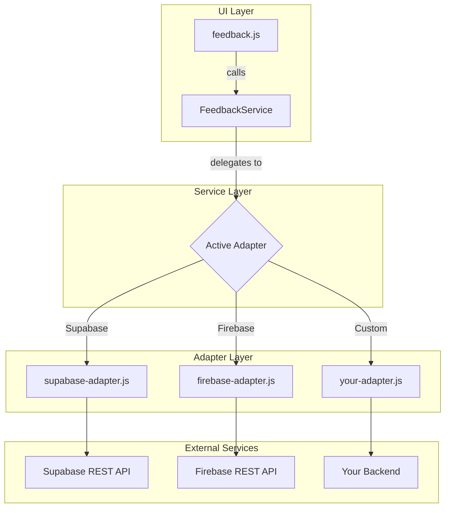
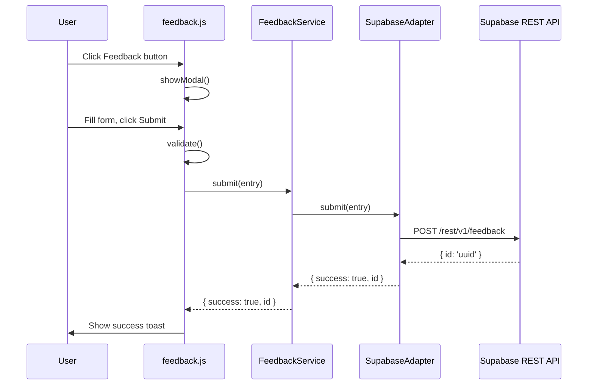

# Feedback Feature Implementation Guide

This document describes the architecture, setup, and maintenance of the feedback system in DSA Visualizer.

## Architecture

The feedback system uses an **adapter pattern** to decouple the UI from the storage backend. This means switching from Supabase to Firebase (or any other backend) requires changing only **one line** in `feedback-service.js`.



### Data Flow



## File Structure

```
src/static/js/
    config.js                    Feature flags (FEEDBACK: true)
    feedback-service.js          Service interface - delegates to adapter
    feedback.js                  UI component - modal, form, validation
    adapters/
        supabase-adapter.js      Supabase REST API adapter (active)
        firebase-adapter.js      Firebase REST API adapter (reference)
```

## How to Switch Backends

### Supabase to Firebase

1. Create a Firebase project and enable Firestore.
2. Add Firebase credentials to your `.env` file (see `.env.example` for variable names).
3. In `feedback-service.js`, change line 8:

```javascript
// Before
import SupabaseAdapter from './adapters/supabase-adapter.js';

// After
import FirebaseAdapter from './adapters/firebase-adapter.js';
```

4. In `feedback-service.js`, change line 45:

```javascript
// Before
adapter = SupabaseAdapter;

// After
adapter = FirebaseAdapter;
```

That is the only code change required. No UI code, no CSS, no HTML changes.

### Supabase to Custom Backend

1. Create a new adapter in `src/static/js/adapters/your-adapter.js`:

```javascript
/**
 * @param {import('../feedback-service.js').FeedbackEntry} entry
 * @returns {Promise<import('../feedback-service.js').FeedbackResult>}
 */
async function submit(entry) {
    const response = await fetch('https://your-api.com/feedback', {
        method: 'POST',
        headers: { 'Content-Type': 'application/json' },
        body: JSON.stringify(entry),
    });
    // ... return { success, id } or { success: false, error }
}

function isReady() { return true; }
function getName() { return 'custom'; }

export default { submit, isReady, getName };
```

2. Swap the import in `feedback-service.js` (same two-line change as above).

## Adapter Interface

Every adapter must implement three methods:

| Method | Signature | Returns |
|--------|-----------|---------|
| `submit(entry)` | `async (FeedbackEntry) => FeedbackResult` | Promise resolving to `{ success, id?, error? }` |
| `isReady()` | `() => boolean` | `true` if credentials are configured |
| `getName()` | `() => string` | Adapter name for logging |

### FeedbackEntry (input)

| Field | Type | Required | Description |
|-------|------|----------|-------------|
| `rating` | `number` | Yes | 1 to 5 |
| `category` | `string` | Yes | `'bug'`, `'feature'`, `'general'`, or `'other'` |
| `message` | `string` | Yes | 10 to 1000 characters |
| `pageUrl` | `string` | No | Auto-captured from `window.location.href` |
| `userAgent` | `string` | No | Auto-captured from `navigator.userAgent` |

### FeedbackResult (output)

| Field | Type | Description |
|-------|------|-------------|
| `success` | `boolean` | Whether the submission succeeded |
| `id` | `string` | Record ID (present on success) |
| `error` | `string` | Human-readable error message (present on failure) |

## Supabase Setup

### 1. Create Project

1. Go to [supabase.com](https://supabase.com) and create a new project.
2. Note your **Project URL** and **anon public key** from Settings > API.

### 2. Create Table

Run this SQL in the Supabase SQL Editor:

```sql
CREATE TABLE feedback (
    id UUID DEFAULT gen_random_uuid() PRIMARY KEY,
    created_at TIMESTAMP WITH TIME ZONE DEFAULT NOW(),
    rating INTEGER CHECK (rating >= 1 AND rating <= 5),
    category TEXT CHECK (category IN ('bug', 'feature', 'general', 'other')),
    message TEXT NOT NULL CHECK (char_length(message) >= 10 AND char_length(message) <= 1000),
    page_url TEXT,
    user_agent TEXT
);
```

### 3. Enable RLS (Row-Level Security)

```sql
-- Enable RLS on the feedback table
ALTER TABLE feedback ENABLE ROW LEVEL SECURITY;

-- Allow anyone to insert feedback
CREATE POLICY "Allow anonymous inserts" ON feedback
    FOR INSERT
    WITH CHECK (true);

-- Block anonymous reads (admin views via Supabase dashboard only)
CREATE POLICY "Deny anonymous reads" ON feedback
    FOR SELECT
    USING (auth.role() = 'authenticated');
```

### 4. Configure Environment

Add your Supabase credentials to `.env`:

```bash
VITE_SUPABASE_URL=https://your-project.supabase.co
VITE_SUPABASE_ANON_KEY=eyJhbGciOiJIUzI1NiIsInR5cCI6IkpXVCJ9...
```

See `.env.example` for the full list of available variables.

### 5. Vercel Configuration

Add the same environment variables in your Vercel project settings:

1. Go to your Vercel dashboard > Project > Settings > Environment Variables.
2. Add `VITE_SUPABASE_URL` and `VITE_SUPABASE_ANON_KEY`.
3. Redeploy.

## Firebase Setup (Alternative)

### 1. Create Project

1. Go to [Firebase Console](https://console.firebase.google.com).
2. Create a project and enable Cloud Firestore.

### 2. Configure Security Rules

In Firestore Rules:

```
rules_version = '2';
service cloud.firestore {
  match /databases/{database}/documents/{document=**} {
    match /feedback/{doc} {
      allow create: if true;
      allow read: if false;
    }
  }
}
```

### 3. Configure Environment

```bash
VITE_FIREBASE_PROJECT_ID=your-project-id
VITE_FIREBASE_API_KEY=your-api-key
VITE_FIREBASE_COLLECTION=feedback
```

## Feature Flag

The feedback module is controlled by a feature flag in `src/static/js/config.js`:

```javascript
const FEATURES = {
    FEEDBACK: true,  // Set to false to disable
};
```

When `FEEDBACK` is `false`, the feedback button is hidden and the module does not initialize.

When the adapter reports `isReady() === false` (missing credentials), the feedback button is automatically hidden even if the feature flag is `true`.

## Client-Side Protections

| Protection | Implementation |
|-----------|---------------|
| Rate limiting | 30-second cooldown between submissions |
| Input validation | Rating 1-5, category whitelist, message 10-1000 chars |
| Double-submit guard | Disable submit button while request is in flight |
| Graceful degradation | Button hidden if adapter not configured |

## Security Notes

- **No SDK dependency.** Both adapters use native `fetch`. This keeps the bundle lean and avoids supply chain risk.
- **Anon keys are public by design.** Supabase and Firebase anon keys are meant to be embedded in client code. Security is enforced server-side via RLS / Firestore Rules.
- **No PII collected.** The form does not ask for email, name, or any personally identifiable information.
- **RLS / Firestore Rules block reads.** Anonymous users can write but cannot read other users' feedback. Admin views submissions through the provider's dashboard.

## Viewing Feedback

### Supabase

Go to your Supabase dashboard > Table Editor > `feedback`. You can view, filter, and export rows to CSV.

### Firebase

Go to Firebase Console > Firestore Database > `feedback` collection.

## Future Enhancements

1. **Email notifications** on new feedback via Supabase Edge Functions or Firebase Cloud Functions.
2. **Feedback analytics** - aggregate ratings and category breakdown in an admin dashboard.
3. **In-app responses** - allow follow-up questions (requires authentication).
4. **Spam filtering** - integrate with a spam detection service.
