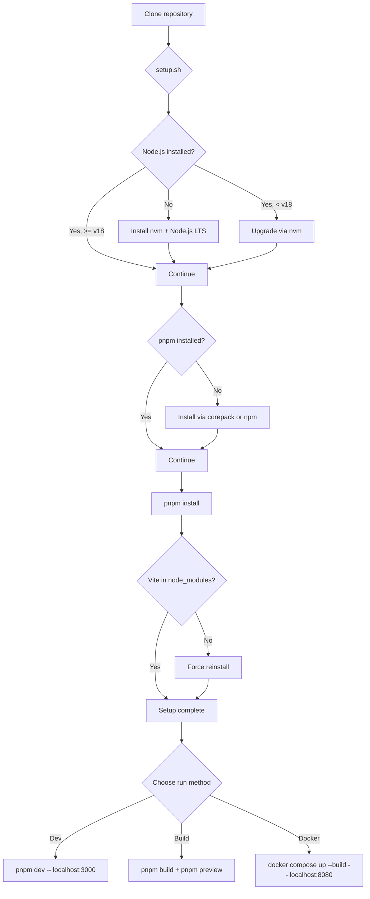

## Setup Guide

This guide covers all the ways to get the DSA Visualizer running locally or in a container.

### Flow



### Prerequisites

- Git
- Node.js 18+ (auto-installed by setup script if missing)
- pnpm (auto-installed by setup script if missing)
- Docker and docker-compose (optional, for containerized deployment)

### Quick Start

Clone the repository:

```bash
git clone https://github.com/<your-username>/dsa-visualizer.git
```

Navigate to the project directory:

```bash
cd dsa-visualizer
```

Run the setup script:

```bash
chmod +x setup.sh && ./setup.sh
```

The setup script is self-healing. It will detect and install any missing dependencies (Node.js, pnpm) automatically. If Vite is missing after `pnpm install`, it forces a clean reinstall.

### Development Server

Start the Vite dev server with hot reload:

```bash
pnpm dev
```

Opens the application at `http://localhost:3000`.

### Production Build

Build the static assets:

```bash
pnpm build
```

Preview the production build locally:

```bash
pnpm preview
```

### Docker Deployment

Build and run the containerized application:

```bash
docker compose up --build
```

Access at `http://localhost:8080`.

The Docker setup uses a multi-stage build:
1. **Stage 1 (node)**: Installs dependencies and runs `pnpm build`
2. **Stage 2 (nginx)**: Copies the built `dist/` folder into a lightweight nginx image

To stop the container:

```bash
docker compose down
```

### What the Setup Script Does

The `setup.sh` script performs the following checks and actions in order:

1. **Node.js check**: If Node.js is not installed or is below v18, it installs nvm and uses it to install the latest LTS version.
2. **pnpm check**: If pnpm is not installed, it attempts to enable it via corepack. If corepack is unavailable, it falls back to `npm install -g pnpm`.
3. **Dependency install**: Runs `pnpm install` to install all project dependencies.
4. **Vite verification**: Checks that `node_modules/vite` exists. If not, it wipes `node_modules` and `pnpm-lock.yaml` and reinstalls from scratch.

### Troubleshooting

**Port 3000 already in use:**

Find and kill the process using port 3000:

```bash
lsof -i :3000
kill -9 <PID>
```

**node_modules corruption:**

Delete and reinstall:

```bash
rm -rf node_modules pnpm-lock.yaml && pnpm install
```

**Docker build fails:**

Ensure Docker daemon is running, then rebuild without cache:

```bash
docker compose build --no-cache
```
