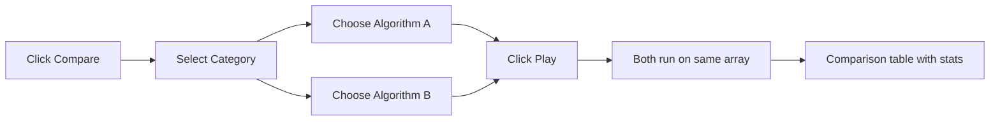
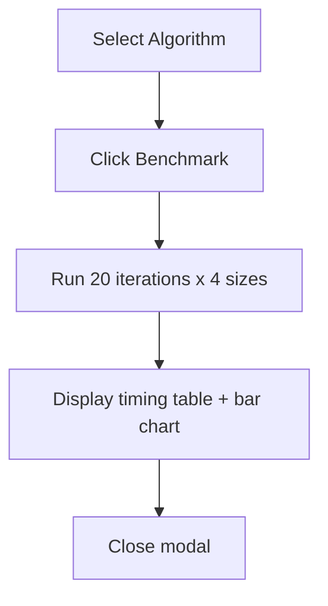
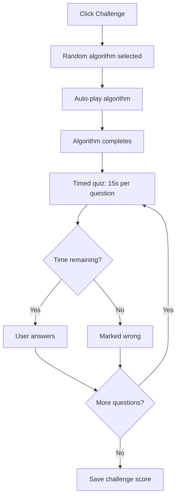

# User Guide

A comprehensive guide to all features of the DSA Visualizer application.

## Table of Contents

- [Core Visualization](#core-visualization)
- [Playback Controls](#playback-controls)
- [Code Display](#code-display)
- [Info Panel](#info-panel)
- [Compare Mode](#compare-mode)
- [Custom Array Input](#custom-array-input)
- [Benchmarking](#benchmarking)
- [Theme and Layout](#theme-and-layout)
- [Recording](#recording)
- [Graph Features](#graph-features)
- [Bar Drag and Drop](#bar-drag-and-drop)
- [Quizzes and Challenge Mode](#quizzes-and-challenge-mode)
- [Achievements](#achievements)
- [Visual Effects](#visual-effects)
- [Keyboard Shortcuts](#keyboard-shortcuts)
- [Cheat Sheet](#cheat-sheet)

---

## Core Visualization

### Algorithm Selection

Select an algorithm from the dropdown in the controls bar. Algorithms are organized into categories:

- **Sorting** -- Classic and practical comparison sorts
- **Fun Sorting** -- Novelty and meme sorts (Bogo, Thanos, Stalin, Sleep, Miracle)
- **Searching** -- Sequential and interval-based search algorithms
- **Trees (BST)** -- Binary search tree operations and traversals
- **Trees (AVL)** -- Self-balancing AVL tree insertion
- **Heaps** -- Min-heap insert and extract operations
- **Graphs** -- Traversal, shortest path, MST, and topological sort
- **Linked Lists** -- Insert, delete, search, traverse, reverse, and more
- **Interesting** -- Maze generation and grid pathfinding algorithms

### Array Configuration

For sorting and searching algorithms:

- **Size** -- Adjust the number of elements (5 to 100) using the slider or number input
- **Speed** -- Control the playback speed (1 to 100) using the slider or number input
- **Distribution** -- Choose how the array is generated:
  - `random` -- Uniformly distributed random values
  - `nearly sorted` -- Array with a few elements out of order
  - `reversed` -- Array in descending order
  - `few unique` -- Array with many duplicate values
  - `List[int]` -- Switches to a numbered cell display (max 10 elements)

### Visualization Types

The visualizer adapts to the selected algorithm type:

- **Bars** -- Vertical bars with height proportional to value (sorting and searching)
- **SVG Tree** -- Node-and-edge tree diagram (BST, AVL, heap operations)
- **SVG Graph** -- Node-and-edge graph diagram (BFS, DFS, Dijkstra, etc.)
- **SVG Linked List** -- Horizontal node-and-arrow chain (linked list operations)
- **Canvas Grid** -- Cell-based maze/pathfinding grid (maze generation, BFS/DFS/A*/Greedy pathfinding)

## Playback Controls

| Control | Action |
|---------|--------|
| **Generate** | Create a new randomized array/data structure |
| **Play** | Start or resume step-by-step playback |
| **Pause** | Halt playback (state is preserved for resuming) |
| **Step** | Execute a single algorithm step (when paused) |
| **Reset** | Stop playback and regenerate fresh random data |

## Code Display

The center panel displays the algorithm's implementation in your chosen programming language. Ten languages are available:

Pseudocode, Python, Java, C++, C, C#, JavaScript, TypeScript, Go, Rust

- Click a **language tab** to switch the display
- The current step's code line is highlighted in real time
- Inline comments mark step numbers (e.g., `# [3] Compare neighbors`)
- Python snippets include full type hints

## Info Panel

The left panel displays algorithm information:

- **How It Works** -- Plain-English description of the algorithm
- **Best Used For** -- Recommended use cases
- **When to Avoid** -- Situations where the algorithm performs poorly
- **Time Complexity** -- Best, average, and worst case
- **Space Complexity** -- Auxiliary memory requirements
- **Live Stats** -- Running comparisons, swaps, and elapsed time

## Compare Mode

Compare two algorithms running side by side on the same array:

1. Click **Compare** to enter compare mode
2. Select a category (Sorting or Searching)
3. Choose two algorithms from the dropdowns
4. Click **Play** to run both simultaneously
5. A comparison table appears showing results side by side

## Custom Array Input

For sorting and searching algorithms, you can manually specify array values:

1. The **Custom Array** field appears below the distribution dropdown
2. Enter comma-separated numbers (e.g., `5,3,8,1,9`)
3. Values are clamped to the range [1, 200]
4. Click **Apply** or press **Enter**
5. The field flashes green on success, red on invalid input
6. A minimum of 2 valid numbers is required

## Benchmarking

Benchmark the current algorithm's raw execution speed:

1. Select a sorting or searching algorithm
2. Click **Benchmark** (appears when a benchmarkable algorithm is selected)
3. A modal displays while running 20 iterations across array sizes [10, 25, 50, 100]
4. Results show a timing table (min, average, max) and a CSS bar chart per size

## Theme and Layout

### Dark / Light Theme

Click the **Light** / **Dark** button in the controls bar to toggle between themes. Your preference is saved to localStorage and restored on next visit.

### Color Themes

The **Theme** selector in the settings panel offers additional color palettes:

- **Default** -- Standard blue accent theme
- **Ocean** -- Blue-teal gradient tones
- **Forest** -- Green earth tones
- **Sunset** -- Warm orange-red tones
- **Monochrome** -- Grayscale with white accent

Theme preference is persisted to localStorage.

### Portrait Mode

Click **Landscape** to toggle to **Portrait** mode. This creates a true 9:16 vertical column layout suitable for recording YouTube Shorts content. The visualization appears at the top with the info and code panels below.

## Recording

Record the browser tab as a video file:

1. Select a recording quality preset from the dropdown
2. Click **Record** -- the button changes to **Stop** and pulses
3. Interact with the visualizer (play algorithms, explain, etc.)
4. Click **Stop** to end recording
5. A `.webm` video file is automatically downloaded

### Quality Presets

| Preset           | Resolution | Bitrate  | FPS |
|------------------|------------|----------|-----|
| Shorts 720p      | 720x1280   | 5 Mbps   | 60  |
| Shorts 1080p     | 1080x1920  | 8 Mbps   | 60  |
| Shorts 4K        | 2160x3840  | 20 Mbps  | 60  |
| Landscape 720p   | 1280x720   | 5 Mbps   | 30  |
| Landscape 1080p  | 1920x1080  | 8 Mbps   | 60  |
| Landscape 4K     | 3840x2160  | 20 Mbps  | 60  |

Sound effects are captured in the recording when enabled.

## Graph Features

### Graph Representations

When a graph algorithm is selected, the **Graph View** dropdown lets you switch between:

- **Graph** -- Node-and-edge SVG diagram (default)
- **Matrix** -- Adjacency matrix table with weighted edge highlights
- **Adj List** -- Per-node neighbor chain view
- **Both** -- Side-by-side matrix and adjacency list panels

### Interactive Graph Builder

Customize the graph structure before running an algorithm:

1. Select any graph algorithm
2. Click **Edit Graph** to enter edit mode
3. **Add a node** -- Click on empty space in the graph area
4. **Add an edge** -- Click a source node, then click a destination node (enter weight when prompted)
5. **Delete a node** -- Right-click on the node
6. **Delete an edge** -- Right-click on the edge line
7. Click **Stop Editing** to exit edit mode

### Graph Export

Click **Export** next to the Edit Graph button to download the current graph structure as a JSON file. The file includes:

- `nodes` -- Array of node IDs
- `edges` -- Array of `{from, to, weight?}` objects
- `adjacencyList` -- Full adjacency list representation

### Graph Node Dragging

When a graph is displayed in the node-edge view, you can reposition nodes:

1. Click and hold on any graph node
2. Drag the node to a new position
3. Edges connected to the node follow in real time
4. Release to place the node at the new position

## Bar Drag and Drop

For sorting and searching algorithms, you can manually rearrange bars:

1. Click **Drag** to enable drag-and-drop (the button shows "Drag (on)")
2. Click and drag any bar to a new position
3. Other bars shift to make room
4. Release to place the bar

### Undo / Redo

- **Ctrl+Z** -- Undo the last bar reorder
- **Ctrl+Shift+Z** -- Redo the last undone reorder

## Quizzes and Challenge Mode

### Post-Algorithm Quizzes

After completing an algorithm, a quiz modal may appear (if enabled):

1. Click **Quiz** to toggle quizzes on or off
2. When enabled, a quiz appears automatically after each algorithm completes
3. Answer multiple-choice questions about the algorithm
4. Correct answers are highlighted in green; incorrect in red
5. Each answer includes an explanation
6. Click **Next** to proceed to the next question
7. Click **Done** after the final question to save your score

Scores are tracked per algorithm and persisted to localStorage.

### Challenge Mode

Challenge Mode picks a random sorting algorithm, runs it automatically, then presents a timed quiz:

1. Click **Challenge** in the controls bar
2. A random sorting algorithm is selected and auto-played
3. When the algorithm finishes, a quiz modal appears with a 15-second countdown per question
4. Answer before time expires -- unanswered questions are marked wrong
5. The timer turns red and pulses when 5 seconds or fewer remain
6. Your challenge scores are tracked separately with a "best" score per algorithm

## Achievements

The gamification system tracks your progress and awards achievements:

| Achievement | How to Unlock |
|-------------|---------------|
| First Sort | Complete your first sorting algorithm |
| Speed Demon | Complete an algorithm in under 1 second |
| Perfectionist | Complete all sorting algorithms |
| Explorer | Try all algorithm categories |
| Comparator | Use compare mode 10 times |
| Night Owl | Use the app after midnight |
| Marathon | Run 100 algorithms in one session |
| Quick Learner | Complete 5 different algorithms in 5 minutes |

- Achievements are displayed as toast notifications when unlocked
- An achievements panel shows all achievements and their status
- Streak tracking counts consecutive days of use
- All progress is persisted to localStorage

## Visual Effects

- **Confetti** -- Particle effects play when an algorithm completes
- **Smooth transitions** -- Bar heights, node positions, and color states animate smoothly
- **Sound effects** -- Compare, swap, complete, and not-found tones via the Web Audio API
- **Volume control** -- Adjust the sound volume with the slider next to the Sound toggle

## Keyboard Shortcuts

| Key | Action |
|-----|--------|
| Space | Play / Pause |
| Right Arrow | Step (when paused) |
| R | Reset |
| G | Generate new array |
| Ctrl+Z | Undo bar reorder |
| Ctrl+Shift+Z | Redo bar reorder |

Shortcuts are disabled when typing in input fields or dropdowns.

## Cheat Sheet

A collapsible reference panel at the bottom of the page:

- **Sorting table** -- All sorting algorithms with best/average/worst/space/stable columns
- **Searching table** -- All searching algorithms with best/average/worst/space columns
- **Key ideas** -- Quick reference for fundamental DSA concepts

Click the **Cheat Sheet** toggle at the bottom of the page to expand or collapse the panel.
